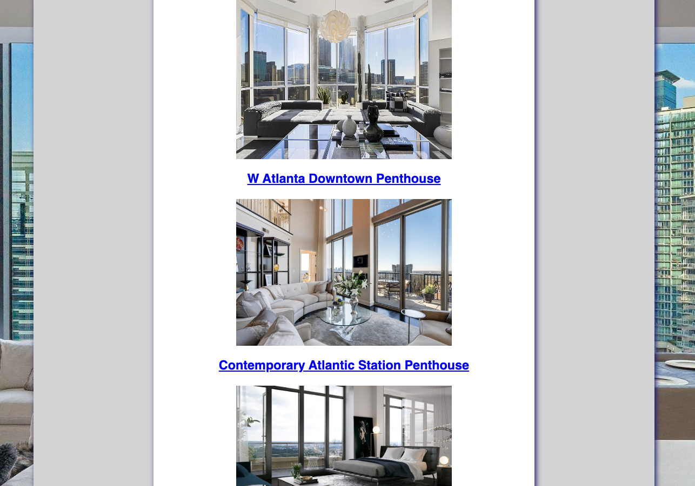

# LuxeStay

##  Date: 7/19/23 

### By: Jacquelyn Waller
###  (www.linkedin.com/in/jacquelyn-m-waller)

## Description
###  A full stack application that allows users to view, rent and review Luxury Rental Penthouses in Atlanta, GA. 

## Technologies
###  Express.js
###  MongoDB  
###  React
###  Javascript
###  HTML
###  CSS

## About the App
LuxeStay is a full stack applications that allows users to find luxury penthouse rentals for short and long term stays. Users can view detailed descriptions of each property for more information about it's luxurious amentities and accomodations. Users can also leave reviews to share details baout their recent visits and see listings for future rentals.

## Screenshots

## Credits
[Atlanta Fine Homes Sotheby's International](https://www.ajc.com/life/private-quarters/this-149-million-buckhead-penthouse-offers-views-of-atlantas-skyline/WMYMEILJGRBQZJCSVKKRVZENFU/)
[Homes & Villas by Marriott](https://homes-and-villas.marriott.com/en/properties/78082393-atlanta-spectacular-midtown-penthouse-with-astounding-views)
[Josh Green, Curbed Atlanta](https://atlanta.curbed.com/2020/3/12/21176446/young-jeezy-atlanta-buckhead-condo-penthouse-for-sale)
[The Extravagant](https://www.theextravagant.com/lifestyle/breathtaking-penthouse-atlanta/)
[Jamie Juviler](https://blog.hubspot.com/website/css-fade-in)

